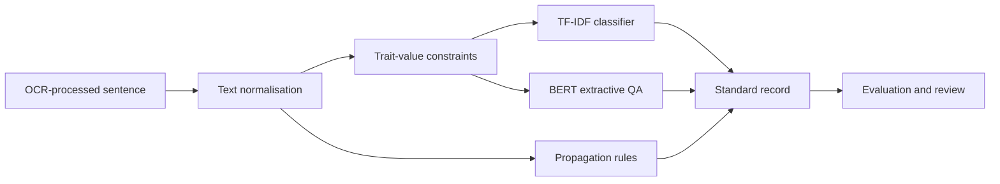
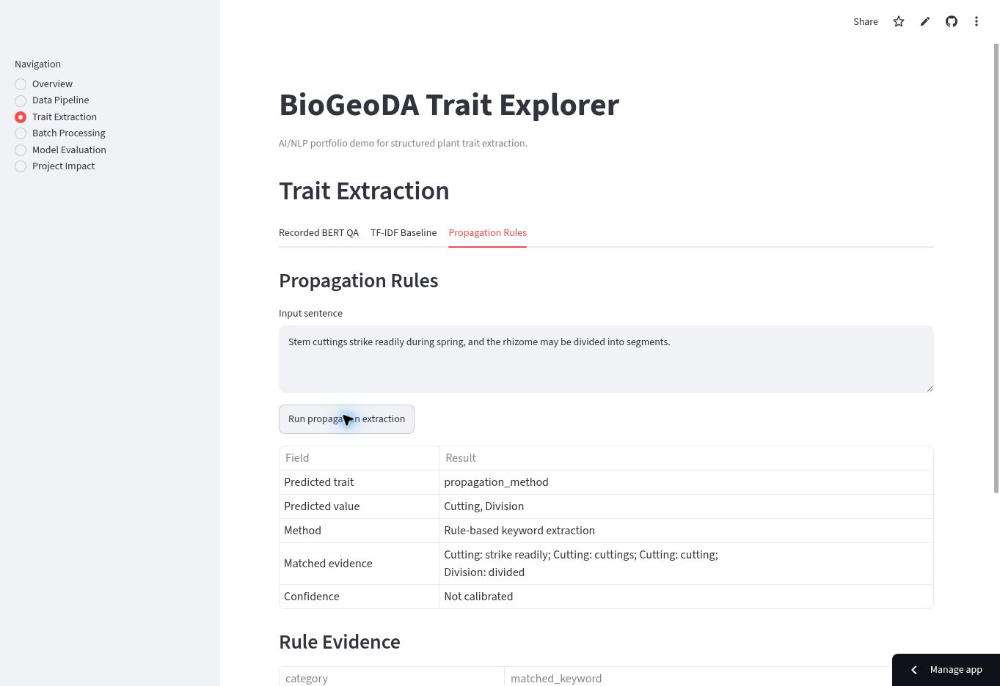

# BioGeoDA NLP Pipeline

[](https://github.com/Jinhyeok513/BioGeoDA/actions/workflows/tests.yml)
[](https://www.python.org/)
[](https://at4fgpvm22qsheizvjagyt.streamlit.app/)

**[Launch the live Trait Explorer](https://at4fgpvm22qsheizvjagyt.streamlit.app/)**

## Overview

BioGeoDA is an NLP pipeline that converts OCR-processed botanical sentences into
structured plant-trait records. It combines text normalisation, constrained
trait-value mapping, extractive question answering, classical text
classification, and deterministic post-processing behind a reproducible Python
interface and interactive Streamlit application.

The engineering objective is not document OCR. It is the next stage of the
pipeline: converting noisy, domain-specific prose into records with a stable
schema:

```text
source_file,page,species_name,sentence,predicted_trait,predicted_value,method
```

## Technical Problem

Plant traits are expressed with inconsistent vocabulary and uneven class
frequency. A single description may contain a direct value span
(`rhizome`), an implicit propagation cue (`stem cuttings strike readily`), or no
relevant evidence. The system therefore separates three responsibilities:

- **candidate classification** with TF-IDF and Logistic Regression;
- **span extraction** with fine-tuned BERT question answering;
- **high-precision post-processing** for explicit propagation language.

This separation keeps outputs traceable and makes model limitations visible
instead of hiding them behind one aggregate accuracy value.

## Pipeline



### 1. Text preprocessing

`src/preprocess.py` normalises Unicode, smart quotes, dash variants, line
breaks, tabs, and repeated whitespace while preserving useful case information.
DataFrame preprocessing is non-mutating and validates the requested text
column.

### 2. Trait-value constraints

`src/trait_mapping.py` converts tabular trait definitions into a normalised
mapping. Allowed values constrain QA dataset construction and prevent unrelated
answer strings from becoming labels.

### 3. Extractive-QA dataset generation

`src/dataset_builder.py` generates Hugging Face-compatible examples only when
the answer occurs in the source context. Each record contains the question,
answer text, and exact character offset:

```python
{
    "context": "Buds occur on a woody rhizome.",
    "question": "What is the bud bank location?",
    "answers": {"text": ["rhizome"], "answer_start": [22]},
}
```

The original experiment produced **137,408 valid QA examples**. BERT was
fine-tuned on a **20,000-example subset for one epoch** and recorded an
evaluation loss of approximately **0.321**.

### 4. TF-IDF baseline

`src/train_tfidf.py` provides a reproducible scikit-learn pipeline with
stratified splitting, `TfidfVectorizer`, Logistic Regression, accuracy, macro
F1, and per-class reporting. The historical experiment achieved:

| Metric | Result | Interpretation |
|---|---:|---|
| Accuracy | 90.7% | Strong aggregate performance |
| Macro F1 | 46.2% | Weak and uneven performance on rare classes |

The 44.5-point gap is the important result: frequent categories dominated the
accuracy score, so accuracy alone overstated performance for uncommon traits.

### 5. Propagation post-processing

`src/propagation_rules.py` loads explicit Seed, Cutting, and Division phrases
from YAML and returns both the category and matched evidence. Ambiguous tokens
such as `firm`, `remove`, `node`, `fire`, and standalone `rhizome` are excluded
to reduce false positives. The rule path is fully runnable without a model
checkpoint and supports batch CSV export.

## Results

| Component | Recorded outcome |
|---|---|
| QA data construction | 137,408 valid answer-span examples |
| BERT QA fine-tuning | 20,000 examples, 1 epoch, evaluation loss ≈ 0.321 |
| TF-IDF + Logistic Regression | 90.7% accuracy, 46.2% macro F1 |
| Human validation | 2,400+ AI candidates reviewed; 844 records retained by the team |

The public sample files are synthetic demonstrations and do **not** reproduce
these metrics. The 844 retained records are a team validation outcome, not an
individual model score.

## Streamlit Demo

The [BioGeoDA Trait Explorer](https://at4fgpvm22qsheizvjagyt.streamlit.app/)
exposes the pipeline as six focused views:

- preprocessing, trait mapping, and QA span construction;
- synthetic BERT-QA workflow examples;
- TF-IDF result interpretation;
- live propagation extraction with matched evidence;
- batch processing and standard-schema CSV download;
- historical metric and class-imbalance analysis.

Live BERT inference activates only when a fine-tuned checkpoint exists locally.
The application never substitutes an unfine-tuned base model or fabricates a
confidence score.



## Repository Structure

```text
BioGeoDA/
├── app.py                         # Streamlit application
├── configs/
│   └── propagation_keywords.yaml # Interpretable extraction rules
├── data/samples/                 # Synthetic public examples
├── results/                      # Historical metrics and safe outputs
├── src/
│   ├── preprocess.py
│   ├── trait_mapping.py
│   ├── dataset_builder.py
│   ├── train_tfidf.py
│   ├── train_bert_qa.py
│   ├── inference.py
│   ├── propagation_rules.py
│   └── evaluate.py
├── tests/
└── .github/workflows/tests.yml
```

## Run Locally

```bash
git clone https://github.com/Jinhyeok513/BioGeoDA.git
cd BioGeoDA
python -m venv .venv
source .venv/bin/activate
pip install -r requirements.txt
streamlit run app.py
```

Optional BERT dependencies are isolated from the lightweight demo:

```bash
pip install -r requirements-bert.txt
python -m src.train_bert_qa --help
```

## Validation

```bash
pytest -q
python -m compileall src app.py
python -c "import app"
```

GitHub Actions runs the same checks on every push and pull request. Tests cover
Unicode cleaning, non-mutating DataFrame transforms, trait normalisation,
answer-span validity, method–trait consistency, standard output schemas,
multi-category extraction, and ambiguous-keyword false positives.

## Limitations

- Historical metrics come from the original experiment notebooks; the
  synthetic public dataset is not a benchmark.
- Rare traits remained difficult despite strong aggregate TF-IDF accuracy.
- Keyword rules favour precision and can miss paraphrases.
- BERT inference requires a fine-tuned checkpoint, intentionally excluded from
  Git.
- Confidence calibration and production monitoring are not implemented.
- PDF acquisition, OCR, databases, and the original dashboard are outside this
  repository's scope.

## Project Provenance

The work originated in a four-person UTS industry capstone. My AI/NLP
contribution covered trait-value mapping, QA dataset generation, BERT QA
fine-tuning, the TF-IDF baseline, propagation post-processing, and evaluation.
This repository independently restructures that work into reusable modules,
tests, CI, and a new portfolio application. Teammate-owned code, confidential
client data, credentials, and copyrighted source documents are not included.

## License

[MIT](LICENSE)
